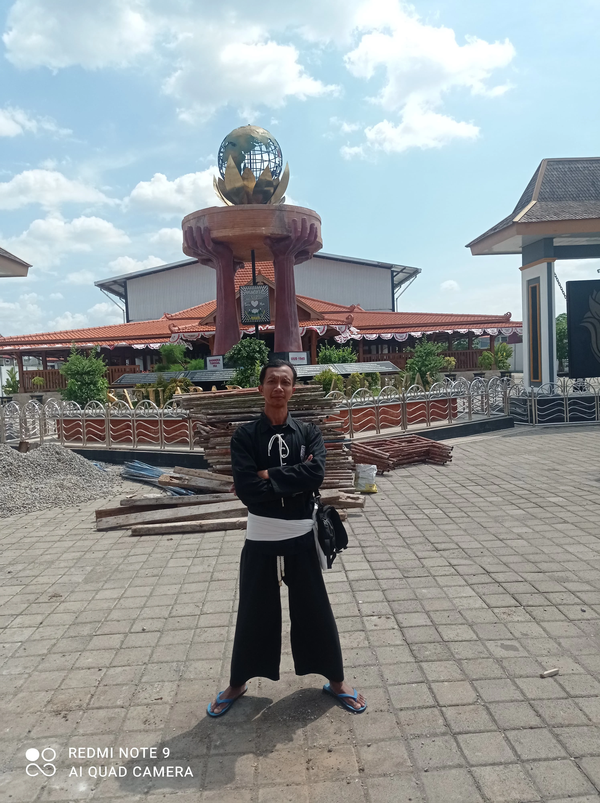
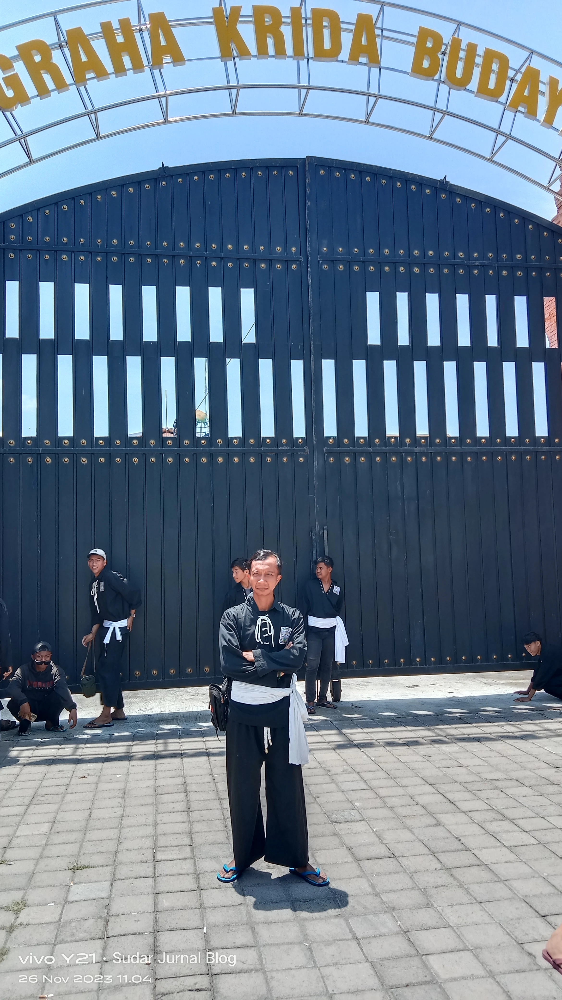

Setelah Acara Deklarasi Pemilu Damai & Temu Kandang di Stadion Wilis selesai akhirnya kami lanjut ke Padepokan Agung Madiun di situ sekalian istirahat dan juga nyekar ke makam para sesepuh pendiri PSHT. 

## Lanjut ke Padepokan Agung PSHT dan Nyekar Sesepuh

Dari Stadion Wilis ini perkiraan perjalanan sekitar kurang lebih 1 jam lah, selama di acara temu kandang ini sebenarnya sudah mengetahui informasi kalau Padepokan Agung PSHT ini tutup akan tetapi kami rombongan mencoba untuk kesana.

Walaupun tidak bisa masuk di padepokan setidaknya masih bisa nyekar. 

Perjalan pun di mulai dari stadion, karena banyak sekatan jalan kami pun mencoba menggunakan google map untuk penunjuk jalan nya. 

Singkat cerita aja ya. 

Kami akhirnya sampai di Padepokan Agung PSHT, yup benar ternyata kalau padepokan tersebut mamang di tutup dan terkunci, akhirnya memutuskan untuk nyekar ke makam. 

Kekecewaan pun kembali ke kami dimana untuk sesi nyekar pun juga di tutup bahkan ada bapak polisi yang menghadang supaya tidak masuk ke area makam. 

Karena sudah terlanjur kesana tentu tidak mau lah tidak mendapatkan hasil, akhirnya saya dan semua rombongan untuk swafoto di depan Padepokan Agus PSHT ini. 

Untuk di dalam area monumen Terate Emas ini ada pembangunan, di walaupun begitu ada celah agar bisa masuk ke monumen tersebut dimana dengan cara tiarap ke gerbang utama di di depan monumen. 

Ternyata alasan nya di tutup itu supaya para warga bisa langsung pulang tanpa harus mampir - mampir, bahkan ada yang menggunkan bus pun harus putar balik karena disuruh pulang oleh petugas nya. 

Walaupun kecawa tapi tidak apa lah rasa penasaran untuk ke madiun sudah terlaksana ke Madiun. 
